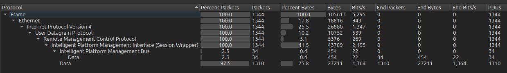
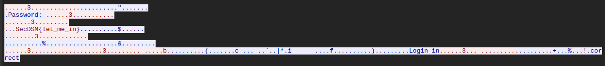
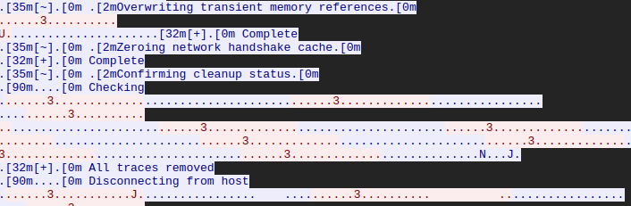
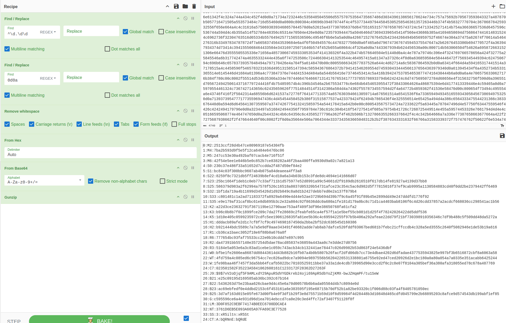
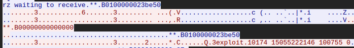
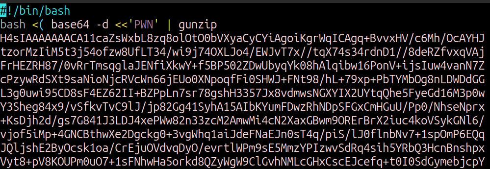

# SecDSM MiniCTF for September 2025
## Deets

Name: air gapped

Author: Coop3r

Link: https://minictf.secdsm.org/airgapped/

## Rules
- There are 3 flags total.
- Standard flag format: SecDSM{flag}
- DM flags to Coop3r.

## Walkthrough
For this MiniCTF, we're provided with a packet capture (pcap) that will lead us to 3 different flags.  As with any challenge that has multiple flags in one file, we may jump around to find the flags in an unusual order.  This write-up starts with Flag #1.

### Flag 1
The pcap file isn't large at 127kB, so I use Wireshark to inspect the contents of the pcap.   A quick check of the Protocol Hierarchy Stats shows that we only have a few protocols to dig into.

There's only one UDP stream, so we open that up to immediately some login attempts that eventually up being successful.  

At first glance- and based on the rules- we see that **SecDSM{let_me_in}** is very likely to be our first flag.  However, before I tried to slide into Coop3r's DMs with this finding, I noticed that it was followed by `Login incorrect` when that is entered.  But a successful login does occur sometime before Frame 235, when the ctrlX CORE logo appears using ASCII.  

Looking between frames 177 and 235, I noticed that there were single characters that matched the original flag, but with some small differences.  With the display filter `ip.src == 172.28.173.108 && (frame.number >=177 && frame.number <= 235)`, I found that some of the characters were actually capitalized.  This was seen as I scrolled down through each of the packets.  

With that, we get a positive confirmation from the man, the myth, the legend, Coop3r that **Flag 1 = SecDSM{Let_Me_In}**.  1 down, 2 to go.

### Flag 3
I don't remember the exact reason, but my instincts told me to jump to the end of the pcap to get an idea of what may have happened after as a result of the login and following actions on the possibly compromised device.  With mentions of `Erasing command history buffer` and `All traces removed` near the end of the pcap, it lead me to think that some kind of automated script was ran on the device.  Something to keep in the back of my mind as I continued to work my way backwards in the timeline.

As I continue, I finally come across very apparent use of base64 encoding for some purpose.  It appears that some data was likely exfil'd off this device from a file called `secrets`.  The script pulled whatever was in the `secrets` file with the command line: `dd if=/dev/secrets | gzip | base64`.  This told us 3 things:
- The contents of the file were of interest
- GZip compression was used to create an archive
- The archive was base64 encoded

To pull the base64 encoding out of the pcap, I went to the command line and used *tshark* to grab the  data from frames 1189 to 1211 using `tshark -n -r ctf-2025-09.pcap -Y "(frame.number>=1189 && frame.number<=1211) && ip.src==10.200.138.212" -T fields -e data`.  With a little bit of cleanup to get rid of some of the data at the beginning and end- like the transfer speed and the console popping back up- I popped the hex encoded data into CyberChef.  With the following [recipe](https://gchq.github.io/CyberChef/#recipe=Find_/_Replace(%7B'option':'Regex','string':'%5E%5C%5Cd.%5C%5Cd%5C%5Cd'%7D,'',true,false,true,false)Find_/_Replace(%7B'option':'Regex','string':'0d0a'%7D,'',true,false,true,false)Remove_whitespace(true,true,true,true,true,false)From_Hex('Auto')From_Base64('A-Za-z0-9%2B/%3D',true,false)Gunzip()), I was able to discover the contents of the secrets file:

Why, these look like hashes!  So the next step to find flag 3 was to probably to do some kind of  password cracking.  And I'll admit, I did try to foolishly crack these hashes with absolute *no insight* if that was even the right thing to do.  I definitely wasted a good chunk of time trying to find the original values for the message digest hash values, with- as you might guess- zero success.

After stepping away for about an hour, I came back to the contents of the file to look at what was unusual.  There had to be something that stood out and for sure, one of the entries was different than the others:

**25:J9:$9$7vV2oDjqf5F9AMLxdY29ApuRSdVYGDkreb24oji69ApRSdbYoZjKMX-bwJZHqmPF/tu1SeW**

A [quick search](https://duckduckgo.com/?t=lm&q=%25249%2524+hash+prefix) told me this was the Type 9 hash used for Juniper OS.  Using my biggest of brains, I did another search by adding `decode` to the end which lead me to the extremely helpful website https://www.m00nie.com/juniper-type-9-password-tool/, which of course had a relevant meme right at the top.  

Another thumbs up emoji reaction in the SecDSM Discord tells me that **Flag 2 = SecDSM{too_many_secrets}** is correct.  2 down, hardest one to go. */me gulps*

### Flag 2
So at this point, I've gotten the flag at the start and the end.  Now I needed the one in the middle.  I knew that I was likely looking for some kind of script being uploaded to the compromised device between frames 241 and 857.  My best guess was something was received by the compromised device, possibly from exploit-db or searchsploit based on the observation of `exploit 10174` observed in some of the traffic.

The other item that stood out in this traffic was what appeared to be data boundaries in the transfer.  As seen above, there was a boundary with the value of **\*\*B0100000023be50**, and within some of those boundaries is what appeared to be raw binary data.

I stared at the data in these packets for HOURS.  I eventually realized that there was an item I had completely glazed over and missed every time: `rz`.  This was part of a unix communication package that also included `sz`.  Using my package manager, I installed the package `lrzsz` onto my device, feeling one step closer.  

Knowing that I would need the data transferred by `rz`, I extracted the data using *tshark* again: `tshark -n -r ctf-2025-09.pcap -Y "(frame.number>=265 && frame.number <= 737) && ip.src == 172.28.173.108" -T fields -e data > flag2`.  But what exactly to do with it was kind of a mystery to me.  I knew it would need a little bit of clean up, much like how I needed to clean up the data for Flag 3, and used this [Cyberchef recipe](https://gchq.github.io/CyberChef/#recipe=Find_/_Replace(%7B'option':'Regex','string':'%5E0.000000'%7D,'',true,false,true,false)From_Hex('Auto')&oeol=VT) and deleting the first 7 bytes contained in the flag2 output file.  

After downloading the output from Cyberchef, I used DuckAI to get some help figuring out the commands I would need to unravel this data and start dissecting it further.  DuckAI told me to use `cat download.dat | rz --binary --overwrite` and VIOLA! I now have an archive file called `exploit`.  A quick check with the *file* utility tells me that it's gzip compressed data, so I rename it real quick to `exploit.gz` and decompress the file.

Oh boy, even more base64 encoding and another compressed gzip'd file to break down!  A few more layers of base64 encoding, hexdump, and gzip compression we finally get a nasty looking bash script that pwns all the things.  And uwu what's this? There's a FLAG that looks like it's using some kind of high-end cryptography to obfuscate its message.

The very tricky ROT13 substitution gives us what we need and **Flag 2 = SecDSM{hack_the_planet}**.

## Wrap Up
The actual final flag for this challenge is **SecDSM{Let_Me_In} SecDSM{too_many_secrets} SecDSM{hack_the_planet}**, as it is requested to send all 3 in one message.  

This challenge really helped to reinforce the knowledge I've acquired over the last few years.  Identifying anomalies is easier when you understand what is normal.  But no matter how much you may know, it's unlikely you'll end up knowing everything.  The biggest reason I figured out this whole challenge is because I knew how to effectively research those anomalies and dig into the tools used by the "attacker" in this challenge.  

